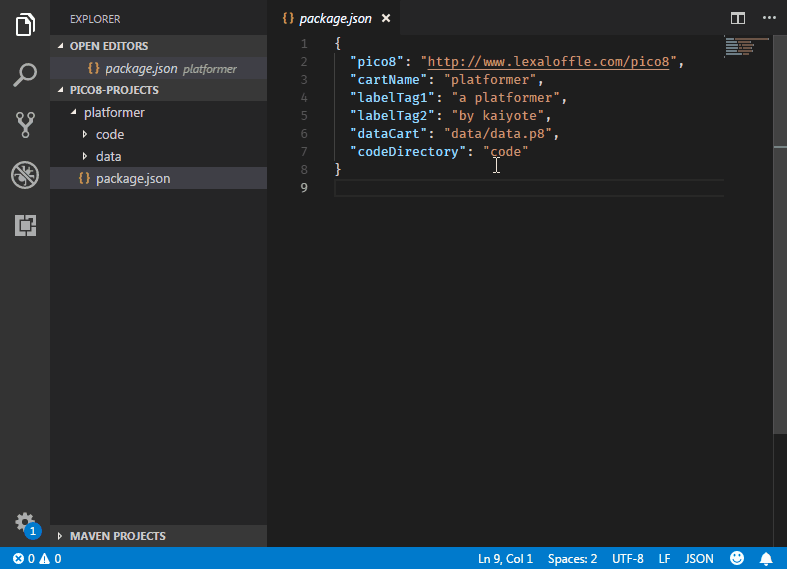

# pico8-cart-builder README

This extension allows you to edit the lua for a pico8 cart in VSCode, and then stitch them all together later into one .p8 cartridge.

## Features

Example package.json for a cartridge:

```json
{
  "pico8": "http://www.lexaloffle.com/pico8",
  "cartName": "platformer",
  "labelTag1": "a platformer",
  "labelTag2": "by kaiyote",
  "dataCart": "data/data.p8",
  "codeDirectory": "code"
}
```

### Explanation of package.json fields
- **pico8**: this must exist to tell the extension that this directory is a pico8 cartridge project
- **cartName**: the name of the cartridge it will generate
- **labelTag(1/2)**: whatever you want to put as comments at the top of the lua script (metadata for the cart)
- **dataCart**: the relative path to the `.p8` cartridge containing the art assets for the finished cartridge
- **codeDirectory**: the relative path to the folder containing your lua scripts

Then simply run the `Pico8: Build Cart` command from the `ctrl+shift+p` menu, and it'll build `cartName.p8` in a `build/` folder next to your package json. This can also be used to build multiple carts at the same time. Simply make a `package.json` for each cart, and let the extension do the work for you.



## Release Notes

### 0.0.1
Initial Release
